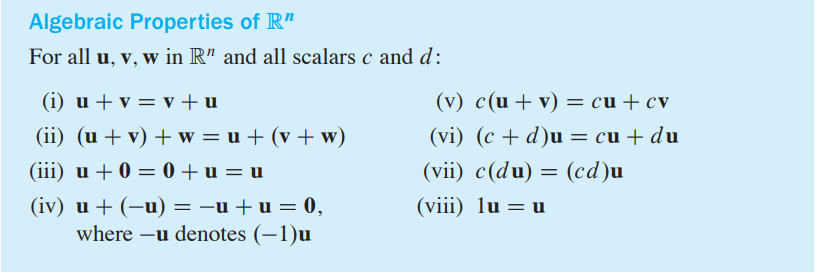
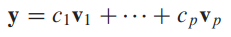
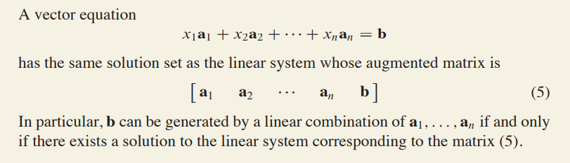

### 1.1 and 1.2

1. A **system of linear equations** is said to be consistent if it has either one solution or infinitely many solutions; a system is inconsistent if it has no solution.

2. Two matrices are called row equivalent if there is a sequence of elementary row operations that transforms one matrix into the other.

3. If the **augmented matrices** of two linear systems are row equivalent, then the two systems have the same solution set.

4. A rectangular matrix is in **echelon form** (or row echelon form) if it has the following three properties:

   (1). All nonzero rows are above any rows of all zeros

   (2). Each leading entry of a row is in a column to the right of the leading entry of the row above it

   (3). All entries in a column below a leading entry are zeros

   We can get property 3 by property 2

   If a matrix in echelon form satisfies the fellowing additional conditions, then it is in **reduced echelon form** (or reduced row echelon form):

   (4). The leading entry in each nonzero row is 1

   (5). Each leading 1 is the only nonzero entry in its column

5. Each matrix is row equivalent to  one and only one reduced echelon matrix

6. A pivot position in a matrix A is a location in A that corresponds to a leading 1 in the reduced echelon form of A. A pivot column is a column of A that contains a pivot position.

   You could learn "the row reduction algorithm" on page 15 in <Linear algebra and its Applications 5th>

   

7. A computer program usually selects as a pivot the entry in a column having the largest absolute value. This strategy, called partial pivoting, is used because it reduces roundoff errors in the calculations.
8. The variables theses corresponding to pivot columns in the matrix are called **basic variables**, otherwise, called **free variables**
9. Whenever a system is inconsistent, the solution set is empty, even when the system has free variable. In this case, the solution set has no parametric representation

### 1.3 VECTOR Equations

- 

- 

  This is called a **Linear Combination** of **v1,....,vp** with wights C1，...,Cp

- 

- 

### 1.4 The MATRIX EQUATION Ax = b （Read it next time...）

