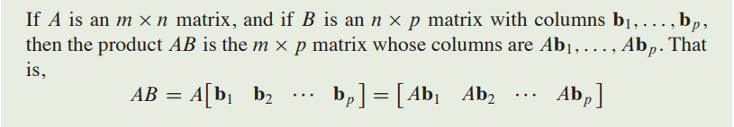
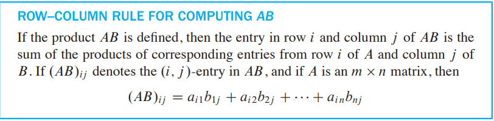
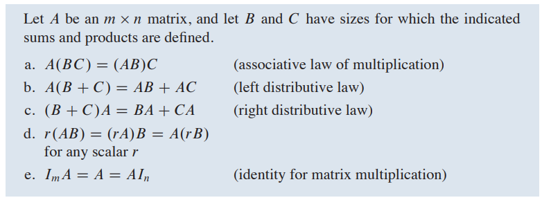
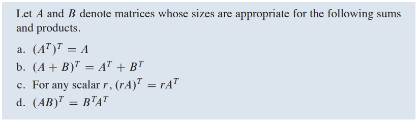
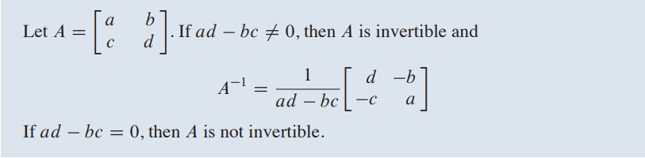
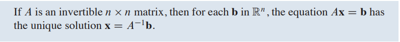
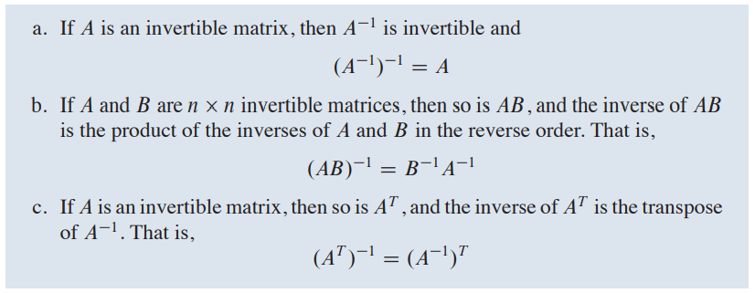
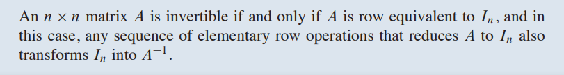

### INTRODUCTORY EXAMPLE

#### Computer Models in Aircraft Design

- *Partitioned matrices*: A typical CFD (Computational fluid dynamics) system of equations has "sparse" coefficient matrix with mostly zero entries. Grouping the variables correctly leads to a partitioned matrix with many zero blocks. Section 2.4 introduces such matrices and describes some of their applications.
- *Matrix factorizations*: Even when written with partitioned matrices, the system of equations is complicated. To further simplify the computations, the CFD software at Boeing uses what is called an **LU** factorization of coefficient matrix. Section 2.5 discusses **LU** and other useful matrix factori

### 2.1 MATRIX OPERATIONS

#### Matrix Multiplication

- 
- Each column of **AB** is a linear combination of the columns of **A** using weights from the corresponding column of **B**
- 
- 
- 

#### Powers of Matrix

> Definition
>
> If **A** is an *n\*n*, matrix and if *k* is a positive integer, then $A^K$ denotes the product of *k* copies of **A**
>
> $A^K$ = A ---- A    （k A）

#### The Transpose of Matrix

- **THEOREM 3**

- The generalization of Theorem above(d) to products of more than two factors can be stated in words as follows:

  > The transpose of product of matrices equals the product of their transposes in the reverse order

-  **NUMERICAL NOTES**
  - The fastest way to obtain **AB** on a computer depends on the way in which the computer stores matrices in its memory. The standard high-performance algorithms, such as in **LAPACK**, caculate **AB** by columns, as in our definition of the product. (A version of **LAPACK** written in C++ calculates **AB** by rows.)
  - The definition of **AB** lends itself well to parallel processing on a computer. The columns of **B** are assigned individually or in groups to different processors, which independently and hence simultaneously compute the corresponding columns of **AB**.

### 2.2 THE INVERSE OF A MATRIX

- Only if in this case, ***CA = I*** **and** ***AC = I*** , ***C*** is **inverse** of ***A***. And ***C*** is uniquely determined by ***A***.

- Here is a simple formula for the inverse of a 2*2 matrix, along with a test to tell if the inverse exists:
  
  
- 

- **2.2 - THEOREM 6**
  

- The generalization of Theorem 6(b):

  #### The product of ***n \* n*** invertible matrices invertible, and the inverse is the product of their inverses in the reverse order.

- **There is an import connection between invertible matrices and row operations that leads to a method for computing inverses. As we shall see, an invertible matrix *A* is row equivalent to an identity matrix, and we can find $A^-1$ by watching the *row reduction of A to I* **

- ##### If an elementary row operation is performed on an *m\*n* matrix A, the resulting matrix can be written as *EA*, where the *m\*m* matrix *E* is created by performing the same row operation on *$I_m$*.

- ##### Each elementary matrix *E* is invertible. The inverse of *E* is the elementary matrix of the same type that transforms *E* back into *I*.

- **THEOREM 7**
  

- ALGORITHM FOR FINDING $A^-1$
  **Row  reduce the augmented matrix [*A I*]. If A is row equivalent to *I*, then [*A I*] is row equivalent to [*I $A^-1$*]. Otherwise, A dose not have an inverse.**

- 