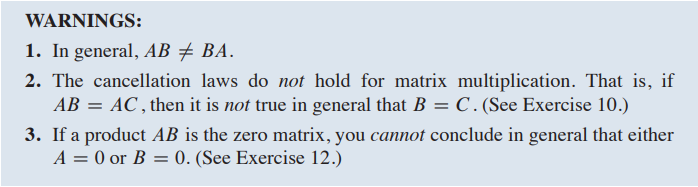

### INTRODUCTORY EXAMPLE

#### Computer Models in Aircraft Design

- *Partitioned matrices*: A typical CFD (Computational fluid dynamics) system of equations has "sparse" coefficient matrix with mostly zero entries. Grouping the variables correctly leads to a partitioned matrix with many zero blocks. Section 2.4 introduces such matrices and describes some of their applications.
- *Matrix factorizations*: Even when written with partitioned matrices, the system of equations is complicated. To further simplify the computations, the CFD software at Boeing uses what is called an **LU** factorization of coefficient matrix. Section 2.5 discusses **LU** and other useful matrix factori

### 2.1 MATRIX OPERATIONS

#### Matrix Multiplication

- 
- Each column of **AB** is a linear combination of the columns of **A** using weights from the corresponding column of **B**
- 
- 
- 

#### Powers of Matrix

> Definition
>
> If **A** is an *n\*n*, matrix and if *k* is a positive integer, then $A^K$ denotes the product of *k* copies of **A**
>
> $A^K$ = A ---- A    （k A）

#### The Transpose of Matrix

- 

- The generalization of Theorem above(d) to products of more than two factors can be stated in words as follows:

  > The transpose of product of matrices equals the product of their transposes in the reverse order

